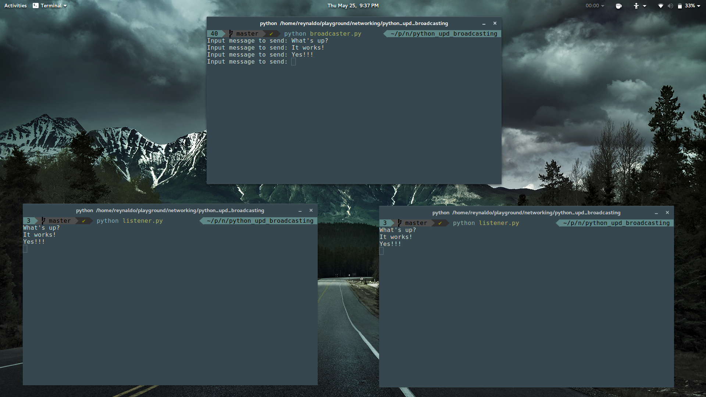

Python UDP Broadcasting
================================

This is just an quick example of UDP broadcasting in Python.
The setup is 1 Broadcaster to Many Listeners.



## How to run

1. Start a couple of terminals (at least 2).
2. In one terminal start the broadcaster

```
python broadcaster.py
```

3. In the other terminal(s) start the listener(s)

```
python listener.py
```

4. Type stuff in broadcaster and see it show up in the other terminals (sick)!


## How to kill it

```
Crtl-C
```

I know it doesn't kill gracefully, but it works.
